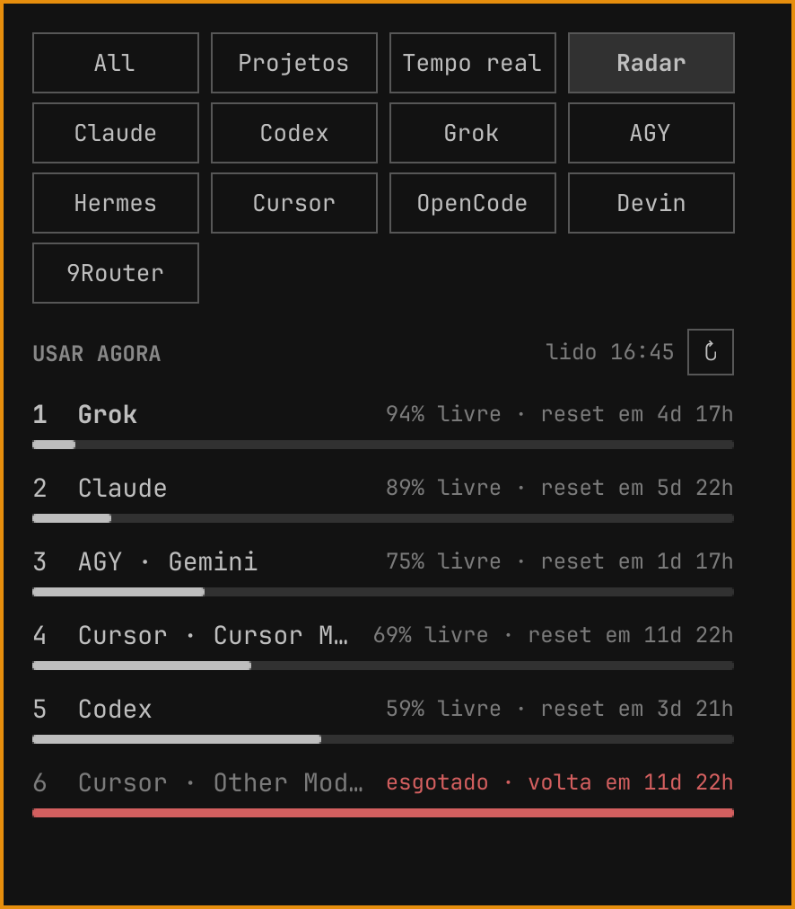

# Omarchy Agents

Richer **Agents** panel for [Omarchy](https://omarchy.org/): one robot icon in the top bar, usage for every harness, All / Hour / Day / Week / Month / Total filters, local project inspection, and a Radar ranking of which quota to burn next.

This is the panel that runs on my Omarchy desktop. Stock `omarchy.agents` only charts Claude, Codex, and Fireworks over the last seven days. This checkout adds:

- **All** tab that sums every harness
- **Hour / Day / Week / Month / Total** token filters. Hour and Day share one snapshot: dated local events supply the hours; remote or billing usage without local timestamps appears separately as “sem horário”. Their totals and model breakdowns use the same sources, including 9Router in All. Week, Month and Total use that same accounting engine. Model headings state the selected window; hidden models are folded into an Other row that preserves the total.
- **Antigravity** and **Hermes** collectors
- **Projects** and **live** views: local sessions, compact project rows, on-demand message previews
- **Radar** tab: ranks live quotas so you know which subscription to burn next (headroom, reset countdown, exhausted pools called out)
- Grok / OpenCode / 9Router tracking when those session files exist on disk. The **9Router** tab keeps each gateway on its own row. All adds that usage onto the harness model with the same id, after dropping the gateway label, the `cc/`/`cx/` route and the effort suffix. Tempo real **Todos** includes 9Router HTTP clients and still hides 9Router rows that only proxy a harness already indexed (Grok CLI).



Plugin id: `lol.agents` (so it can sit beside stock `omarchy.agents` without colliding).

Upstream PR to land the same work in Omarchy itself: [omacom/omarchy#10400](https://github.com/omacom/omarchy/pull/10400).

## Install

```bash
omarchy plugin add https://github.com/LucasOl1337/omarchy-agents.git --enable --yes
```

Then replace the stock widget in the bar with this one. In `~/.config/omarchy/shell.json`, change the bar entry `omarchy.agents` to `lol.agents` (right section), or:

```bash
omarchy plugin enable lol.agents --section right --after omarchy.tailscale
```

and remove `omarchy.agents` from the layout so you do not get two robot icons.

For updates from a local checkout, publish an immutable runtime generation:

```bash
python3 bin/deploy.py
quickshell ipc -p /usr/share/omarchy/shell call lol.agents diagnostics
```

The installer atomically updates the installed manifest after copying all QML, JavaScript, assets and collectors. New URLs prevent a long-running shell from reusing old QML components. Diagnostics report the **loaded** version, readiness, selected period, source totals, displayed-row sum and model sum. A closed panel has not necessarily read its local ledger yet (`ready: false`).

Left click opens the panel. Right click launches the default agent. Middle click cycles subscriptions.

## Collectors

On refresh the plugin runs stock `omarchy-agent-usage-update` (Claude, Codex, Fireworks), then the extra collectors in `bin/`:

| Collector | What it adds |
|---|---|
| `grok` | SuperGrok weekly pool + local session tokens |
| `antigravity` | Gemini / Claude / GPT quotas via `agy` |
| `hermes` | Tokens by model from local Hermes sessions |
| `9router` | Federated Local + Railway usage from the local gateway API, with local DB fallback |
| `codex` | Overrides stock: packaged `-a untrusted` fails on codex 0.154 |

The panel also **displays** any JSON record already in `~/.local/state/omarchy/agents/usage/` (Grok, OpenCode, …).

## Accounting and verification

Local records use the machine's calendar; a gateway's Today retains the gateway's day. Gateway totals without local timestamps are never spread across invented hours. Session-wide cumulative data that crosses a period boundary is excluded from bounded totals and explicitly reported; lifetime totals retain it without inventing dated buckets. Projects and live views inspect this machine's records, while All can also include remote account totals.

All sums the available sources. Known local proxy records and OpenCode mirrors are excluded from repeated counting. Remote account totals without shared request identities cannot prove that every cross-source request is unique. A fallback such as Railway's Jcode is labelled and covers only those sessions.

```bash
python3 -m unittest discover -s tests
node --test tests/test_*.js
# Run only in an agent-bench, never in the human desktop:
python3 tests/runtime_probe.py --bench YOUR_BENCH
python3 tests/runtime_probe.py --bench YOUR_BENCH --real-data
python3 bin/benchmark-tracking.py
```

See [the v1.8 audit](docs/audit-tracker-v1.8.md) for regressions, runtime evidence and remaining source limitations.

## License

MIT. See [LICENSE](LICENSE).
